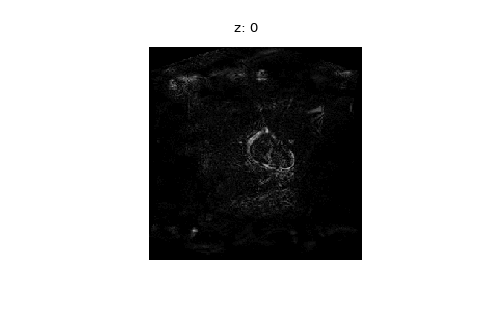
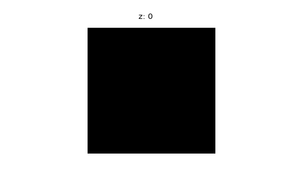

# MRI CNN Segmentation


## Introduction
This repository contains code to train and evaluate Densely Connected Convolutional Neural Networks (DCNet) 
for semantic segementation on magnetic resonance images.
The architecture developed for this framework is an expansion of the [DensetNet](https://arxiv.org/abs/1608.06993), 
in the sense that it is an autoencoder with shortcuts like in [UNet](https://arxiv.org/abs/1505.04597) and can be trained on 3D data.

### Prerequisites

Which packages and software you need to install

- python 3.x
    - numpy
    - matlplotlib
    - pickle
    - pydicom 
    - nibabel 
    - nrrd 
    - yaml 
    - Keras
    - tensorflow
- gdcmconv (for decompressing mri .dcm)


### Installing
Simply clone this repository into the desired directory.
```shell
$ git clone https://gitlab.com/iss_mia/cnn_segmentation/tree/master desired_directory
```

## Networks/Architectures 
Architectures are implemented in [/network/models.py](../network/models.py).
### DCNet
DCNet: Densely connected networks (including modifications: dilated convs, ...)

 

### MRGE
MRGE: merge-and-run mapping network

 

## Whole-body semantic organ segmentation
### Data

At the moment data reading is specialised for the two epidemiological MR imaging databases Cooperative Health Research in the Region of Augsburg 
[KORA](#references) [1] and German National Cohort [NAKO](#references) [2].

|       | # of patients | mri format  | format labels | image size  | available labels                   |
|:------|:-------------:|:-----------:|:-------------:|:-----------:|:-----------------------------------|
| KORA  |173            |dicom        |nifti          |288×288×160  | liver, spleen                      |
| NAKO  |97             |dicom        |nrrd           |320x316x260  | liver, spleen, (kidney, pancreas)  |


> **Note**: Integration of labels liver and spleen for NAKO is still in progress.


One example picture of each data set in coronal, saggital and transversal plane. The labels are plottet over the mris (red: liver, green: spleen).

| KORA                | NAKO
|---------------------|---------------------|
| | |

### Usage
In the following there is given a short description how to use the given framework.

#### Training
The DCNet is defined in [/network/models.py](../network/models.py).
An exemplary picture can be found in the chapter Further Information under [Architecture](#architecture).
To train a model, you need to prepare the configuration file [/config/config.yml](../config/config.yml) 
where all the parameters needed for creating and training a model are precised.
In order to actually perform training, use the following command.

```shell
$ python demo_train.py -c config/config.yml -e experiment_name
```
All the logs of the experiments are stored in the folder /exp/experiment_name.

#### Evaluation
To evaluate a trained model, you need to prepare the configuration file [/config/config_eval.yml](../config/config_eval.yml)
where all the parameters for plots and metrics calculation are given.
In order to evaluate a trained network, use the following command.

```shell
$ python demo_evaluation.py -c config/config_eval.yml -e experiment_name -eval evaluation_name -i iteration_step
```
All the logs of the experiments are stored in the folder /exp/evaluation_name.

> **Note**: iteration_step can be used if you trained more than one model for an experiment (see [config/config.yml](../config/config.yml))

### Example Prediction
In the following there are results of two trained networks are given.

|KORA     | NAKO    |
|---------|---------|
|||


## Adipose tissue segmentation

## Attenuation map estimation

## Patient Buffer: Dynamic Data Loading

Important background info to get an intuition of how to set the parameters *patient_buffer_capacity* 
and *batches_per_shift* in [config/config.yml](../config/config.yml).

#### 1 . Settings in fit(...) of training.py:<br/>
<table>
<tr>
<th>Setting</th> <th>Explanation</th> <th>Impact</th>
</tr>
<tr>
<td>patients_train</td><td>List of patient-object instances (util.py), method (load_slices(...)) to load mri.</td><td></td>
</tr>
<tr>
<td>data_valid</td><td>List of patient-object instances for validation. These patients slices, (mri+labels) are loaded before the training and are kept in RAM during the whole training process, (see load_correct_patients(...) of util.py).</td><td>RAM</td>
</tr>
<tr>
<td>batch size</td><td>Integer. Defining the amount of crops per mini-batch. <br/>Note: Choose as high as possible (limited by available VRAM).</td><td>VRAM</td>
</tr>
<tr>
<td>patient_buffer_capacity</td><td>Integer. Defining the amount of training patient-slices kept in RAM at each time. <br/>Note: One mini-batch should ideally represent the whole data set, i.e. setting patient_buffer_capacity too low may increase bias of gradients.</td><td>RAM</td>
</tr>
<tr>
<td>batches_per_shift</td><td>Integer. Defining how many mini-batches are drawn from the buffer before one shift-operation. Shift-operation: slices of one patient are dropped from RAM and slices of a new patient are loaded on RAM. <br/>Pro-Tip: Choose this as low as possible (bias!), but high enough to prevent gpu from idling, i.e. figure out how many mini-batches are processed by gpu while loading slices of one new patient to RAM.</td><td></td>
<tr>
<td>empty_patient_buffer</td><td>Boolean. Indicating whether a patient buffer will be emptied after training one model. <br/>Note: Important to set this "True" if you train more than one model within one script. Otherwise RAM is leaking!</td><td> RAM</td>
</tr>
<tr>
<td>max_q_size <br/>(no setting, but good to know)</td><td>Integer. Maximum amount of preloaded crops. <br/>Note: Default maximum length of queue is (batches_per_shift) + 1. For further information see Keras docu.</td><td> RAM/VRAM</td>
</tr>
</table>

#### 2 . Further hints:
<table>
<tr>
<th>Setting</th><th>Explanation</th><th>Impact</th>
</tr>
<tr>
<td>patient_buffer_capacity</td><td>Calculating with approximately 0.5 GB per patient (KORA dataset). <br/>Note: That's your greatest impact on RAM!</td><td> RAM </td>
</tr>
<tr>
<td>batches_per_shift</td><td>Ex.: patient_buffer_capacity of 15 works well with batches_per_shift about 25.</td><td> </td>
</tr>
<tr>
<td>data_valid </td><td>Calculating with approximately 0.5 GB per patient (KORA dataset).</td><td> RAM </td>
</tr>
<tr>
<td>empty_patient_buffer</td><td>Set "True" if you train more than one model in one run!</td><td> RAM </td>
</tr>
</table>

## Data Augmentation 
Background information for the implementation of *tricubic interpolation* for data augmentation 
within [/preprocessing/preprocessing.py](../preprocessing/preprocessing.py).

> **Note**: Still in progress, information will be provided later.


## References
[1] 
> Holle R, Happich M, Löwel H, Wichmann HE, study group MKORA, others. KORA-a research platform for population based health research. 
Das Gesundheitswesen 2005;67(S 01):19-25.

[2]
> Bamberg F, Kauczor HU, Weckbach S, Schlett CL, Forsting M, Ladd SC, Greiser KH, Weber MA, Schulz-Menger J, Niendorf T, Pischon T, 
Caspers S, Amunts K, Berger K, Bulow R, Hosten N, Hegenscheid K, Kroncke T, Linseisen J, Gunther M, Hirsch JG, Kohn A, Hendel T, 
Wichmann HE, Schmidt B, Jockel KH, Hoffmann W, Kaaks R, Reiser MF, Volzke H. 
Whole-Body MR Imaging in the German National Cohort: Rationale, Design, and Technical Background. Radiology 2015;277(1):206-220.
